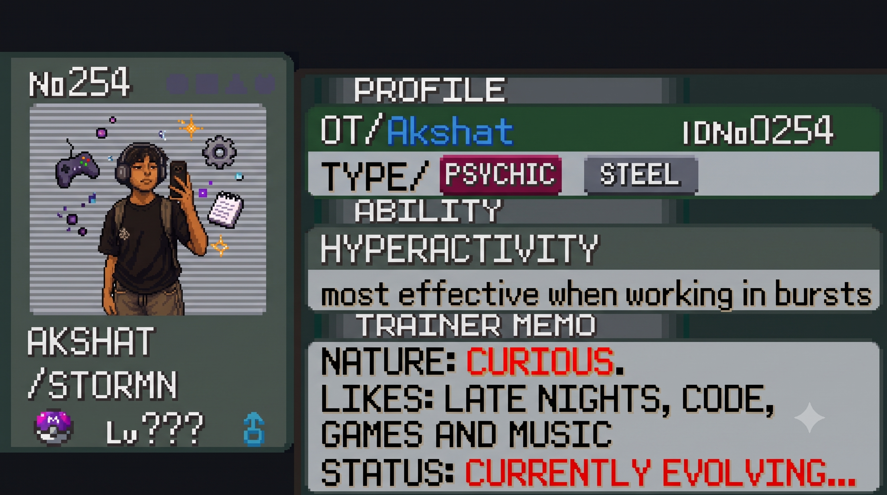

# Scanning...

  

---

## 📟 Pokédex Entry: Akshat (Stormn13)

> *"You play the cards you are dealt."*
> 
> A developer deeply curious about Game Development and the intricate workings of low-level systems. 
> 
> When not diving close to the metal, this entity can often be found playing the guitar, exploring photography, or catching up on basketball and football. And naturally, it spends a significant amount of time playing Pokémon.

## ⚔️ Moveset (Tech Stack)

- **`LANGUAGES`:** TypeScript, C++, GDScript, Bash, Python
- **`GAME DEV`:** Godot Engine, Godot shaders, Gameplay Mechanics
- **`AI & ROBOTICS`:** Agentic AI(langgraph), OpenCV, Ardunio and ESP-32

## 🌟 Evolution Log

This entity is currently gaining EXP in:
- **`DATA STRUCTURES & ALGORITHMS (DSA)`**: Optimizing base stats and logic routing.
- **`Quantum Computing`**: Exploring the quantum realm and learning to harness qubits for next-gen computation.
- **`LANGGRAPH`**: Exploring advanced AI agent workflows and graph-based logic.

---

  <i>"End of scan. Encounter rates may vary based on caffeine intake."</i>

